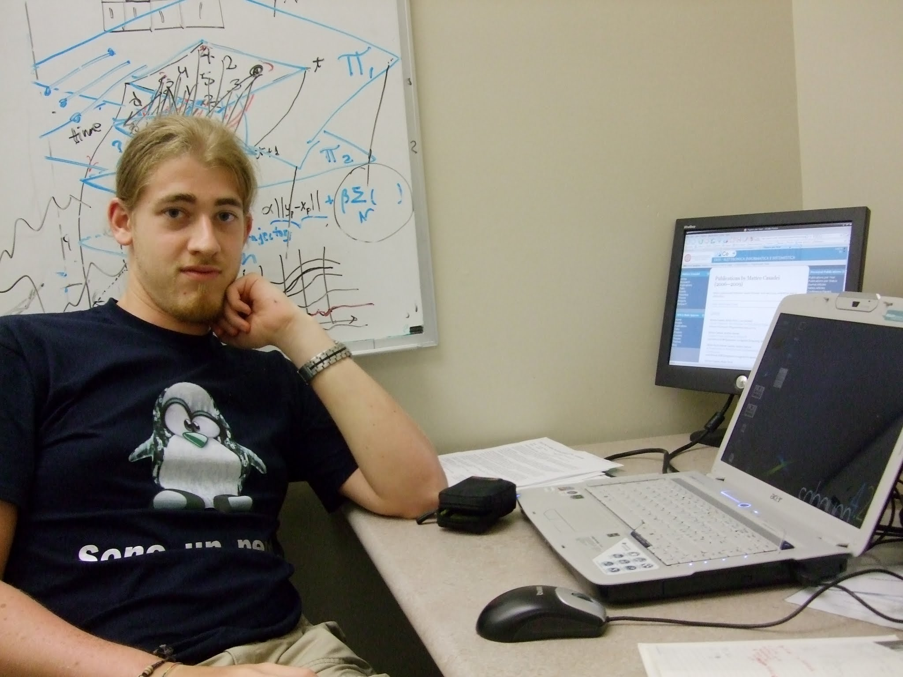
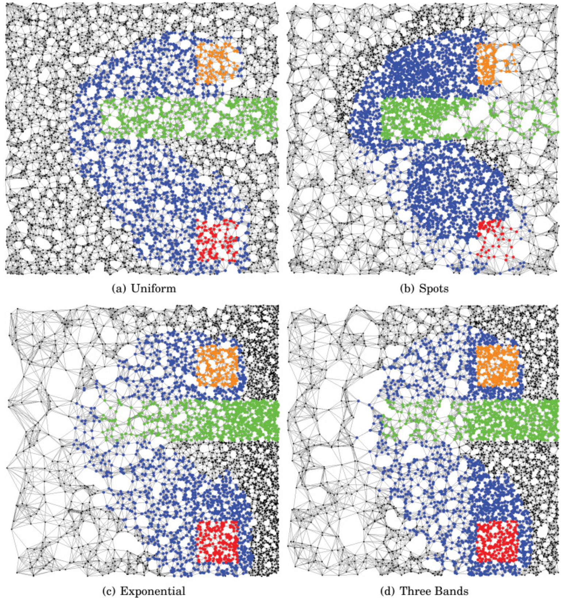
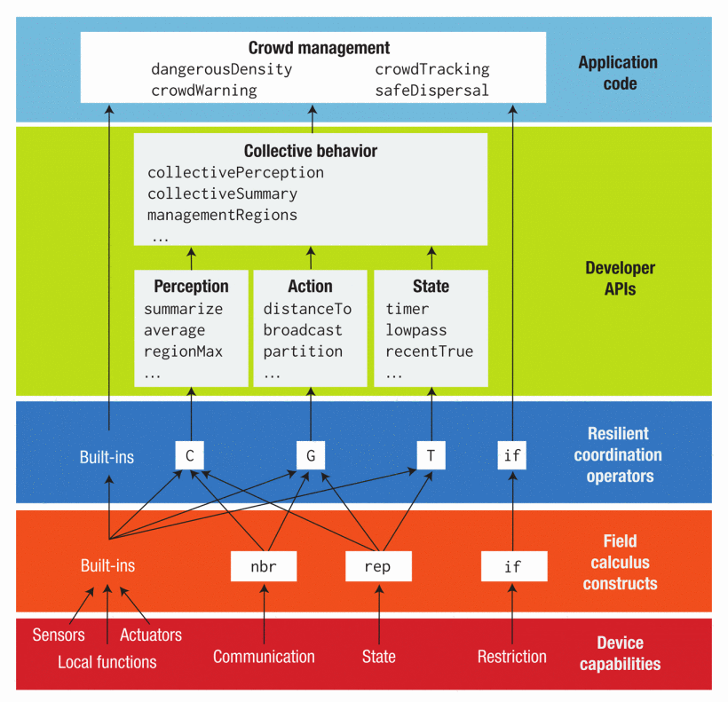

+++

title = "A brief introduction to my research activities"
description = "A brief introduction to my research activities, to be presented at the University of Hohenheim, Jan 2026."
outputs = ["Reveal"]
aliases = [
    "/guide/"
]

+++

# A brief introduction to my research activities

## [Danilo Pianini](mailto:danilo.pianini@unibo.it), {}

---

# Who am I?

{}{}

(note: picture from 2014, I may look older now)
{}{}
**Danilo Pianini**
* Associate Professor @ University of Bologna
* Department of Computer Science and Engineering (DISI), Cesena, Italy

*Research:*
* about 100 publications in peer-reviewed venues
* Head of the [Pervasive Software Lab](https://pslab-unibo.github.io)
 
*Institutional roles:*
* Department Delegate for Open Science
* FAIR Champion of UniBo

*Teaching:*
* Object-Oriented Programming (Bachelor)
* Software Design and Development (Bachelor)
* Software Process Engineering (Master)
* Micro-macro Computational Models: Theory, Applications, and Emergent Properties (Collegio Superiore)

{}{}

---



---



---

# Main research theme:
# **Self-organizing pervasive systems**

{}{}

{}{}
*Context:*
* large-scale systems made of many heterogeneous devices
* devices interact locally
  * central coordination impossible, undesirable, or available only intermittently
* global behavior emerges from local interactions
    * classically, inspired by natural systems (e.g., social insects)
* the system must be:
  * robust to failures (including unknown unknowns)
  * adaptive to changing environments
  * scalable to large numbers of devices

*Main open questions:*
* how do we test/verify such systems?
* how do we engineer emergence?
* how do we deal with openness and unpredictability?
{}{}

---

## Florida Institute of Technology - 2009 (master student)

{}{}

{}{}
* First working period abroad
* Agent-based approaches: design simple agents that interact locally to produce global behaviors
* Ant-colony-inspired approach to move similar files closer together in a distributed storage system
* Validated by run on multiple systems (nine PCs)
* First publication: [Self Organization in Coordination Systems Using a WordNet-Based Ontology](https://doi.org/10.1109/SASO.2010.35), SASO 2010

* <i class="fa-solid fa-question"></i> where is "large scale"?
* <i class="fa-solid fa-question"></i> portability of the approach?
  {}{}

---

## The Alchemist Simulator - 2011 (master thesis)

{}{}

<iframe width="560" height="560" src="https://www.youtube.com/embed/N-DDVA04uJQ?si=_6RngQtW9q3xk1G-&autoplay=1&mute=1&loop=1" title="YouTube video player" frameborder="0" allow="accelerometer; autoplay; clipboard-write; encrypted-media; gyroscope; picture-in-picture; web-share" referrerpolicy="strict-origin-when-cross-origin" allowfullscreen></iframe>
{}{}
* We need simulation to test in large scale
* Agent-based, time-driven simulators scale to ~10² agents before becoming effectively unusable
* *Idea*: pick a high-performance engine from stochastic chemistry, and extend the model to spatially distributed systems
    * Risk: extensions destroy performance
    * Result: not as fast as pure chemistry, but it can still simulate ~10³-10⁴ agents efficiently
* First journal publication: [Chemical-oriented simulation of computational systems with ALCHEMIST](https://doi.org/10.1057/jos.2012.27)

* <i class="fa-solid fa-question"></i> how to reflect changes in the environment within the digital world?
* <i class="fa-solid fa-question"></i> how to simulate richer environments?
  {}{}

---

## The SAPERE Project - 2012 (PhD student)

{}{}

{}{}
* [SAPERE: Self-aware Pervasive Service Ecosystems](https://doi.org/10.1016/j.scico.2015.06.003)
  * PI: Franco Zambonelli (Università di Modena e Reggio Emilia)
  * EU FP7 project (2010-2013)
* *Idea*:
  * devices and network are reified as "live sematic annotations" (LSAs) in a shared space
  * LSAs combine by means of "eco-laws" to produce emergent behaviors
* Somewhat a predecessor of the "digital twin" concept

* <i class="fa-solid fa-triangle-exclamation"></i>
  Minimal changes to the desired algorithms require a *complete redesign* of the eco-laws
  <i class="fa-solid fa-triangle-exclamation"></i>
  * <i class="fa-solid fa-triangle-exclamation"></i>No modularity<i class="fa-solid fa-triangle-exclamation"></i>
  * <i class="fa-solid fa-triangle-exclamation"></i>Limited reusability<i class="fa-solid fa-triangle-exclamation"></i>
{}{}

---

## The Alchemist Simulator pt. 2 - Johannes Kepler Universität, Linz, 2013 (PhD student)

{}{}
<video loop="" playsinline="" autoplay="" muted="" style="max-width: 100%; display: inline-block; ">
  <source src="https://alchemistsimulator.github.io/home-animation.mp4" type="video/mp4">
  If your browser supported the video tag, there would be a nice video.
</video>
{}{}
* First doctoral period abroad
* Alchemist became capable of simulating the SAPERE model and more:
    * Biological systems (e.g., [A model for drosophila melanogaster development from a single cell to stripe pattern formation](https://doi.org/10.1145/2245276.2231999))
    * Smart cities (e.g., [HPC from a self-organisation perspective: The case of crowd steering at the urban scale](https://doi.org/10.1109/HPCSim.2014.6903721))
    * Execution on High-Performance Computing Clusters (e.g., [Distributed statistical analysis of complex systems modeled through a chemical metaphor](https://doi.org/10.1109/HPCSim.2014.6903715))
* The simulator is ready for complex, large-scale experiments

* The open question remains:
  * <i class="fa-solid fa-question"></i>How do we design self-organizing software top down, modularly?
{}{}

---

## Aggregate Computing - Raytheon BBN Tech., Cambridge, MA, USA, 2014 (PhD student)

{}{}

{}{}
* Amorphous computing ([Programming an Amorphous Computational Medium](https://doi.org/10.1007/11527800_10))
  introduced the idea of programming millions of devices as a single computational unit,
  and programming them via *global-to-local compilation*.
* $\Rightarrow$ [MIT Proto](https://doi.org/10.1109/MIS.2006.29) implemented this idea,
  but its semantics was [complex and formalized only ex- post](https://doi.org/10.1016/j.scico.2012.12.003).
* $\Rightarrow$ The [Field Calculus](https://doi.org/10.1016/j.scico.2015.11.005) was a simplified formal model
  designed to capture the essence of such systems.
* $\Rightarrow$ From the Field Calculus, we designed [Protelis](https://doi.org/10.1145/2695664.2695913),
  the first Higher-Order, practical aggregate programming language.
* $\Rightarrow$ From Protelis, we derived the [Higher Order Field Calculus (HOFC)](https://doi.org/10.1145/3285956).
* $\Rightarrow$ The HOFC became the theoretical foundation of [Aggregate Computing](https://doi.org/10.1109/MC.2015.261).
{}{}

---

## Aggregate Computing in a nutshell

{}{}

{}{}
* Compute by means of **computational fields**:
  * A computational field is a *mapping from devices to values*
  * Computational fields can be combined, transformed, and manipulated as first-class values
* The perception is that of a **single computational device** operating on fields
  * Each device runs the same program
  * Each device can sense the surrounding values of fields
  * Each device contributes its own value to the fields
* *Round based* execution model, each device repeatedly:
    1. gathers neighbor values and senses local context
    2. computes the program
    3. shares the result with neighbors
* **(functional) Language-based approach**:
  * The programmer writes programs in a dedicated language (e.g., Protelis)
  * Programs are compiled to local code for each device
  * The distributed execution produces the desired global behavior
  * *Reuse and modularity are built-in!*
      * a library of *proven self-stabilizing building blocks* is available
      * *composition* of building blocks is *guaranteed to preserve self-stabilization*
{}{}

---

## Research directions

Aggregate Computing opened many research directions:

{}{}
<video loop="" playsinline="" autoplay="" muted="" style="max-width: 100%; display: inline-block; ">
  <source src="Emerge.mp4" type="video/mp4">
  If your browser supported the video tag, there would be a nice video.
</video>
{}{}

* Swarm Robotics
  * [A Demonstrator for Self-organizing Robot Teams](https://doi.org/10.1007/978-3-031-95589-1_12)
  * [MacroSwarm: A scala framework for swarm programming](https://doi.org/10.1016/j.scico.2024.103182)
  * [A Field-Based Approach for Runtime Replanning in Swarm Robotics Missions](https://doi.org/10.1109/ACSOS66086.2025.00017)
* Communication in navigation systems
    * [Robust Communication Through Collective Adaptive Relay Schemes for Maritime Vessels](https://doi.org/10.1109/ACSOS66086.2025.00019)
* Federated Learning
  * [Decentralized proximity-aware clustering for collective self-federated learning](https://doi.org/10.1016/j.iot.2025.101841)
* "Pulverization" of deployed components
  * [Scalability through Pulverisation: Declarative deployment reconfiguration at runtime](https://doi.org/10.1016/j.future.2024.07.042)
  * [Dynamic IoT deployment reconfiguration: A global-level self-organisation approach](https://doi.org/10.1016/j.iot.2024.101412)
* Bio-inspired construction
    * [An Aggregate Vascular Morphogenesis Controller for Engineered Self-Organising Spatial Structures](https://doi.org/10.1109/ACSOS61780.2024.00032)
* Multi-drone tracking
  * [Decentralized Multi-Drone Coordination for Wildlife Video Acquisition](https://doi.org/10.1109/ACSOS61780.2024.00021)
{}{}

---

## Other relevant activities

{}{}
### Technology transfer: Project **Wood4.0** - Partner: SCM Group
* Automated, self-healing update system for large-scale wood processing manufacturing machines
  * (patent pending)

{}{}
### Advanced Tooling

 

**Collektive**: Aggregate Programming in pure Kotlin

 

**JaKtA**: type-safe Belief-Desire-Intention agent-oriented programming

 

**Emerge**: affordable swarm robotics
{}{}

---

## People (alphabetical order by column)

|                                                                                               |                                                                                                |                                                                                             |                                                                                             |                                                                                             |
|-----------------------------------------------------------------------------------------------|------------------------------------------------------------------------------------------------|---------------------------------------------------------------------------------------------|---------------------------------------------------------------------------------------------|---------------------------------------------------------------------------------------------|
|   |      |   |   |   |
| Gianluca Aguzzi   Post-Doc Researcher                                                      | Martina Baiardi   PhD Student                                                               | Samuele Burattini   Post-Doc Researcher                                                  | Roberto Casadei   Tenure-Track Researcher                                                | Giovanni Ciatto   Tenure-Track Researcher                                                |
|      |      |   |        |    |
| Angela Cortecchia   PhD Student                                                            | Davide Domini   Phd Student                                                                 | Nicolas Farabegoli   Phd Student                                                         | Andrea Omicini   Full professor                                                          | Danilo Pianini   Associate Professor                                                     |
|                                                                                               |   |     |                                                                                             |                                                                                             |                                                                                             
|                                                                                               | Alessandro Ricci    Associate Professor                                                     | Mirko Viroli    Full professor                                                           |                                                                                             |                                                                                             |                                                                                             

---

# Collaborations

* Joint research activity
  * Let's start small, and see if it grows!
* PhD students exchanges
* Master students internships / theses abroad?

##  ACSOS 2026: shameless plug 

$\Rightarrow$ Cesena is hosting the 2026 edition of the **IEEE International Conference on Autonomic and Self-Organizing Systems** (ACSOS)
* A great chance to meet and discuss!
